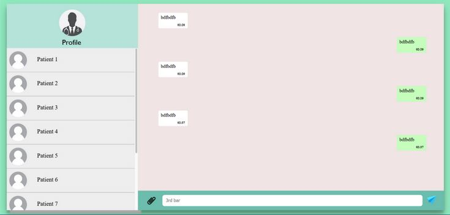

# Chatting Forum for Doctors and Patients

This repository showcases a sophisticated Chatting Forum designed to facilitate open and convenient communication between doctors and patients. The platform serves as a means for patients to reach out to doctors for assistance and advice even outside of regular appointments. This README provides an exhaustive breakdown of the platform's codebase, its features, and the mechanisms by which data is stored and retrieved using local storage.

## Table of Contents

- [Introduction](#introduction)
- [Installation](#installation)
- [Usage](#usage)
- [Data Storage and Retrieval](#data-storage-and-retrieval)
- [File Descriptions](#file-descriptions)
- [Contributing](#contributing)
- [License](#license)

## Introduction

The Chatting Forum for Doctors and Patients is an innovative web-based platform developed with a clear purpose: to enable smooth and real-time interactions between doctors and patients, ensuring access to medical guidance and support even during times when direct appointments are not possible.

## Installation

To set up the Chatting Forum, follow these steps:

1. Clone this repository to your local machine.

2. Open the `index.html` file using a web browser to access the platform.

## Usage

The platform offers an intuitive and user-friendly interface that caters to both doctors and patients. The following steps illustrate its usage:

1. **Select Your Role**: Upon loading the `index.html` file, you'll be prompted to choose your role as either a "Doctor" or a "Patient" by clicking on the respective profile image or name. This selection sets the context for your interactions within the platform.

2. **Initiate Conversations**: Once your role is chosen, the platform presents you with a chat interface tailored to your role. In the chat window, type your message in the input box located at the bottom. Click the send button to transmit your message.

3. **Persistent Conversations**: Regardless of whether you refresh the page or close and reopen your browser, the chat history remains intact. Local storage technology ensures that your conversations are preserved for seamless continuity.

## Data Storage and Retrieval

One of the fundamental aspects of the Chatting Forum is its ability to retain chat histories through local storage. Here's a detailed insight into the data storage and retrieval process:

1. **Message Creation**: When a user composes a message and clicks the send button, the `createNote1` function is invoked. This function constructs a new message object with the message content, timestamp, and a unique identifier.

2. **Data Structure**: Messages are organized as an array of message objects. Each message object comprises properties such as `title1` (message content), `date` (timestamp), and `id` (unique identifier).

3. **Local Storage Update**: The newly created message object is added to the relevant array (e.g., `notes`) and saved in the local storage using `localStorage.setItem("notes", JSON.stringify(notes))`.

4. **Displaying Messages**: The `displayNotes1` function retrieves the stored messages from local storage. It then populates the chat window with the retrieved messages, providing a comprehensive overview of the conversation history. For example:

notes.forEach((note) => {
  const li = document.createElement("li");
  // ... Create and append elements for the message content
  ul.appendChild(li);
});

5. **Seamless Continuity**: The utilization of local storage guarantees that messages are accessible across different sessions, ensuring that ongoing conversations remain consistent and uninterrupted.

## Benefits of Using localStorage

Using localStorage to store chat messages locally offers several benefits:

1. Users can close the browser or refresh the page without losing their chat history.
2. Messages persist across browsing sessions, providing a seamless experience.
3. No need for server-side storage or complex authentication for basic chat functionality.

## File Descriptions

- `index.html`: The HTML file lays the foundation for the platform's structure. It incorporates elements such as user profiles, chat cards, and input boxes for message composition.

- `index.css`: This CSS file defines the visual appearance of the platform, including layout arrangements, color schemes, and typography choices.

- `index.js`: The JavaScript file enables interactive functionality on the web interface. It manages user profile selection, the transmission and display of messages, the toggling of profile details, and seamless integration with local storage.

## Design and CSS Styling

The visual design of the Chatting Forum for Doctors and Patients is thoughtfully crafted to provide an intuitive and engaging user experience. The CSS styling significantly contributes to achieving this objective. Here's a detailed overview of the key design elements and styling decisions:

### Layout and Background

The overall layout of the platform is characterized by a clean and organized structure. Key design aspects include:

- A responsive layout that adapts well to different screen sizes.
- The `body` element has a background color that sets a calming and professional tone for the platform.
- The `#chatting_box` container encompasses the entire platform and uses vertical and horizontal centering to ensure proper alignment.

### User Profiles and Navigation

- User profiles are located at the top-left corner of the platform, indicating both the profile image and name. They are interactive, allowing users to click on them to access profile details.
- Upon clicking on a profile, the profile details overlay smoothly slides in from the left. An arrow icon indicates the ability to collapse the overlay.
- CSS transitions are employed to create a visually appealing slide-in effect for the profile details overlay.
- The `z-index` property is used to manage the stacking order of elements, ensuring proper layering of the profile overlay.

### Chat Interface Styling

- The chat interface is divided into two main sections: the user selection panel (`#user_select`) and the conversation display area (`#cards`).
- The user selection panel employs scrollable functionality using the `overflow-y` property, ensuring that users can navigate through a list of available users.
- Individual user cards are styled to present a consistent and visually appealing appearance. CSS classes such as `.user1`, `.user2`, etc., are applied to differentiate user cards.
- The selected user card expands to occupy the majority of the conversation display area, emphasizing the active conversation.

### Message Display

- Messages are displayed within a `notes-container` for each user, using CSS classes such as `.notes-container1`, `.notes-container2`, etc.
- The `ul` (unordered list) element is used to organize individual messages as list items (`li`).
- Alternate background colors are applied to distinguish different messages, contributing to improved readability.

### Responsive Design

- The CSS layout ensures responsiveness across different devices, ensuring that the platform remains accessible and functional on various screen sizes.
- The use of relative and percentage-based measurements helps elements adapt to different screen dimensions.

### Hover and Interaction Effects

- Various hover and interaction effects are implemented to enhance user engagement. For instance, hovering over a user profile or chat message triggers background color changes for visual feedback.
- The arrow icon within the profile overlay rotates on hover to indicate its interactive nature.

### Colors and Typography

- A carefully selected color palette consisting of shades of green and neutral tones contributes to a professional and visually pleasing interface.
- The typography is defined using system fonts and some carefully chosen fallbacks to ensure readability.

The combination of these design elements and styling decisions results in a polished and user-centered platform that caters to the needs of both doctors and patients.

Feel free to adapt and enhance the CSS styling to align with your project's branding and design requirements.

## Contributing

Contributions to this project are greatly appreciated! If you have suggestions for enhancements or novel features, don't hesitate to open an issue or submit a pull request.

## License

This project is licensed under the MIT License.

Feel free to adapt and enhance this README to align with the specific attributes and structure of your project.